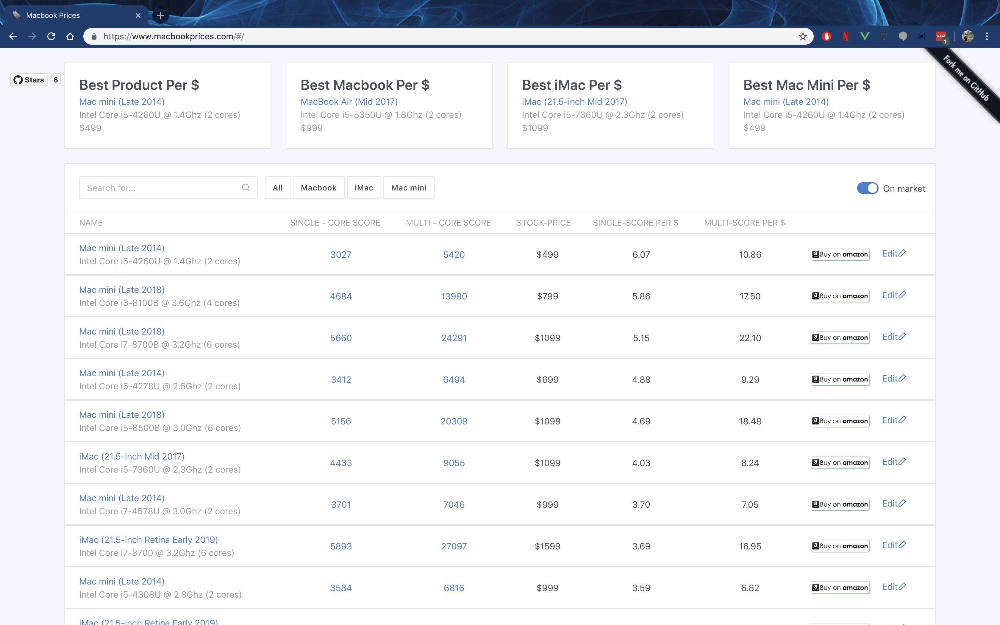
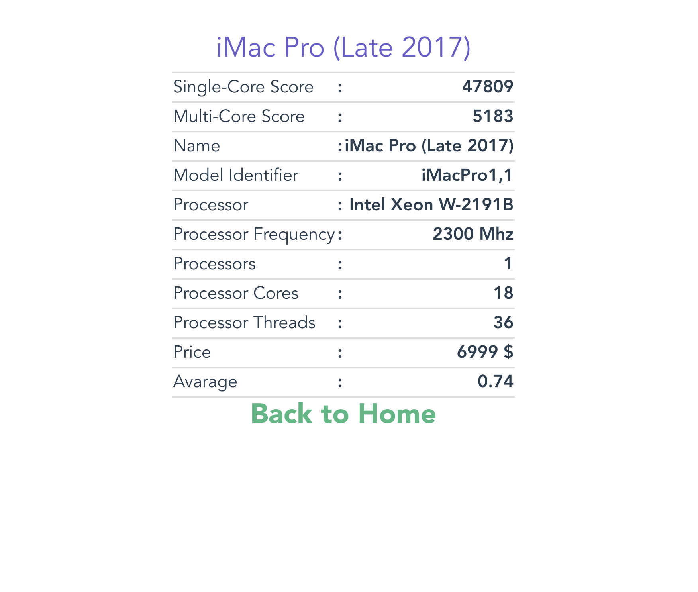

# 💻 Mac Scores 🖥

## 🚻 For Whom?
 🤔 If you need help to decide **which *Mac*** that you going to buy,
 💻 If you need to find out **how powerful your *Mac*** is,
 🖥 If you need to **compare *Macs* with yours**,
 ⏳ If you want to see which ***Macs* are available on market**,
 ⌛️ And which ***Macs* not available on market**,
 💰 If you want to find out **stock-prices of available *Macs***,
 💯 And if you want to do all of this **easily**,
 
   🎉 Then you're at the right place. **Mac Scores builded for you!**  🎉

## 👀  Code overview
🎈 Server-less Design 
🎈 GH-Pages
🎈 Front-end framework 🔗 [Vue.js](https://vuejs.org/) 
 
## 🆒 Features
✅ Mobile UI
✅ Easy to use
✅ Interactive templates
✅ Reactive search & filtering

### Home Page

  

### Mac Profile Page

# 💝 Contributing

We are so grateful for all volunteers like you for contributions. And we are so exciting to welcome your contributions!🙏 Our 🔗[issue tracker](https://github.com/svtek/smart-emailing/issues) is the preferred channel for bug reports, features requests and submitting pull requests. After that, you can start to fork!

1. Fork it
2. Create your feature branch (`git checkout -b my-new-feature`)
3. Commit your changes (`git commit -am 'Add some feature'`)
4. Push to the branch (`git push origin my-new-feature`)
5. Create new Pull Request

🔎 But before opening a feature request, please take a moment to find out whether your idea fits with the scope and aims of the project. It's up to you to make a strong case to convince the project's developers of the merits of this feature. So, you can provide as much detail and context as possible.

# :muscle: Team

|    [Sahin Boydas](https://twitter.com/sahinboydas) Idea By  [![LinkedIn][1.1]][1] |   [Batın](https://github.com/batin) Developed By  [![Github][2.1]][2] | 
| - | - |

[1.1]: https://www.kingsfund.org.uk/themes/custom/kingsfund/dist/img/svg/sprite-icon-linkedin.svg (linkedin icon)
[1]: https://www.linkedin.com/in/sahinboydas
[2.1]: https://i.ibb.co/MCYbxqK/Git-Hub-Mark-64px.png (github.com/batin)
[2]: http://www.github.com/batin

# 🎓 License

This program is a free and open source software. You can redistribute it and/or modify it under the terms of the license provided in the 🔗[LICENSE](LICENSE) file. Use of this software is subject to important terms and conditions as set forth in the 🔗[LICENSE](LICENSE) file.

# 🔍 Acknowledgement

If you liked Smart-Emailing app, please give us a "**Star** :star:". Your support is what keep us moving forward and delivering happiness to you! Thank's a million, you're our *Clark Kent*/*Kara Danvers*! In case of any questions or concerns, feel free to contact us anytime. :blush: